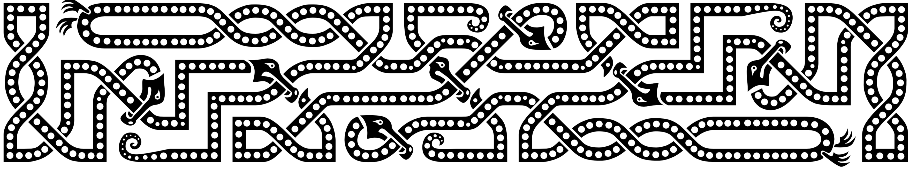
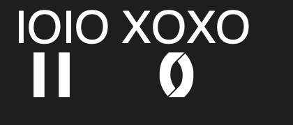
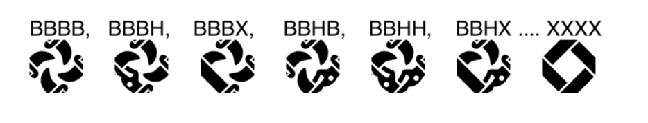
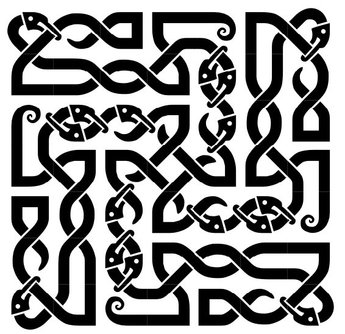
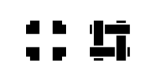
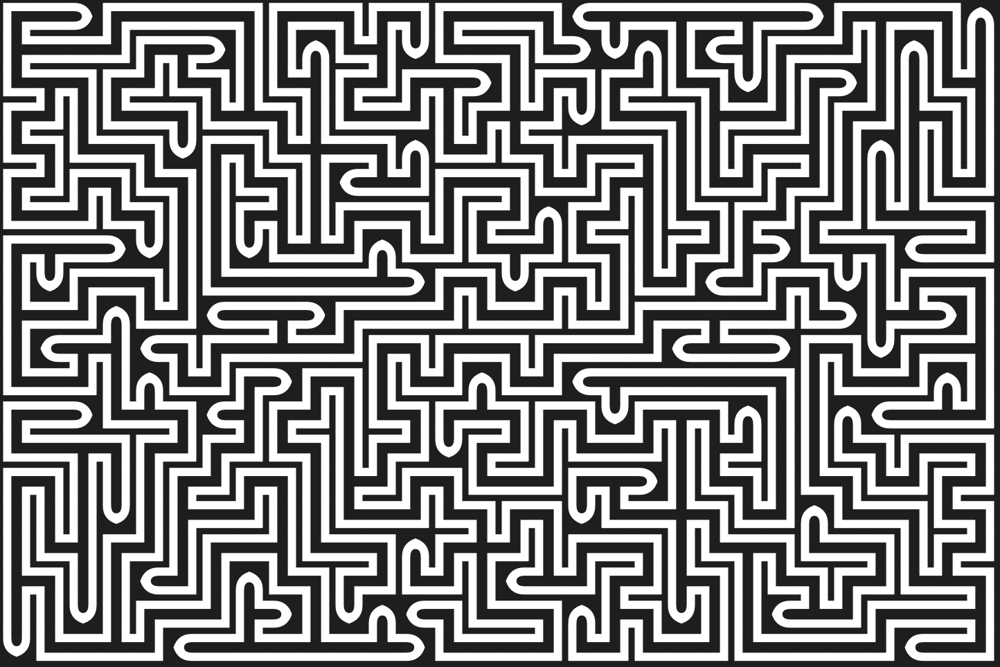
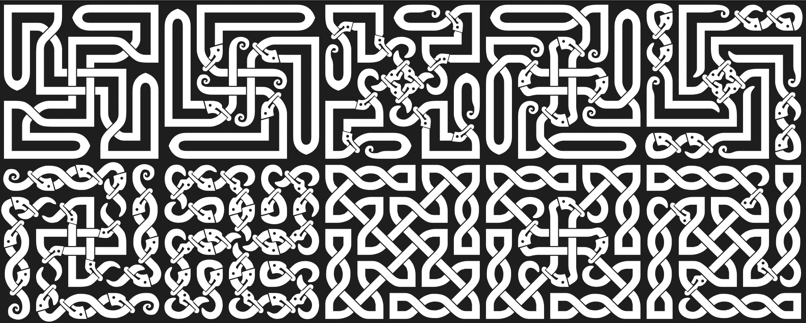

# Knotwork 
This codebase was forked from https://github.com/MrBenGriffin/Amaze.


## The Font
You will need the font 'KNOTS Zoo' (any variant) installed with ligatures set for this to show what it is doing.

Although the font is included in this project, I recommend you go to https://fontlibrary.org/en/font/knots to geth the very latest versions!

You can use the font directly in any text editors that support ligatures or character alternatives.
You can use the box drawing characters (Unicode U+2500) and character alternatives in e.g. Adobe via the glyphs window.
You can also use the built in ligature support, which is pretty straightforward,

Each Celtic character has 4 edges, which are treated here in a clockwise order starting at the top of the character.
If the edge is not connected, then type an O.  If it is connected, there are two primary choices:
"Straight" or "Twisted". A vertical straight knot is IOIO, while a vertical twisted knot is XOXO



Whenever one is using a twist, one can replace it with a Head (H) on one side, and a Beak (B) on the other.
This dramatically increases the combinations of knots... For instance, the original character XXXX now has 80 variations, 
starting with BBBB, BBBH, BBBX, BBHB, BBHH, BBHX .... XXXX



So, one can type out knots such as..
```bash
OHXOOXOBOOOXOIXOOOBIOXIOOOHX
XIOOOXOIOXOXXOOXHOHOIOXOBOXO
OBIOOHOHOHOBOOXBBOHOXOXOXOOO
IXOOOOXXOXBOXXXXBOOXXXOOOOIX
OOXOXOXOHOBOXBOOOBOHOHOHIOOB
XOBOXOIOHOHOOXXOOXOXOIOXOOXI
HXOOIOOXBIOOXOOIOXOOOBOXXOOH
```
and it should appear as



This also works with lower case - but one glyph will change in lower case.
The "IIII" has an alternative form when typed as "iiii". This is great when working on connections.




## application requires:
Python 3  
The GUI is not yet available! (When the GUI is working, you may need tkinter!)

# Launching The application:
```bash
python3 ./text.py 19 19 850 300 4
```
This takes from two or more numeric parameters. Each one affects the knot work generated.

* 1: Width.  The number of characters wide. It must be more than 1.
* 2: Height. The number of characters high. It must be more than 1.
* 3: Straights Balance. This is a value between 0 and 1000. 0 = All straights, 1000=all twists. Default is 150.
* 4: Zoomorphic Balance (Only affects twists). This is a value between 0 and 1000. 0 = All twists, 1000=all Zoomorphs. Default is 300.
* 5: Transform, 0: None; 1: Horizontal Mirror; 2: Vertical Mirror; 3: Rotate 180; 4: Rotate 90 (needs width and height to be the same. Default is Rotate.

You can still draw mazes also, by turning the Straights balance right up



But this project is mainly for drawing celtic knotwork, with zoomorphics thrown in just for fun!
Parameters 3 and 4 have a very strong effect - have a look at some examples



There are three interesting miners here.
## Mazer
The maze-generating miner. Appears to produce the best mazes so far...

## Spiral
A spiral-generating miner. Generates nice spirals

## Clone
Copies another Miner, either mirroring or rotating.
